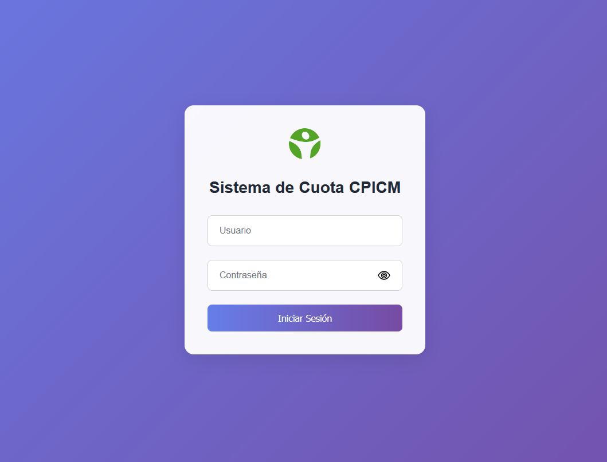
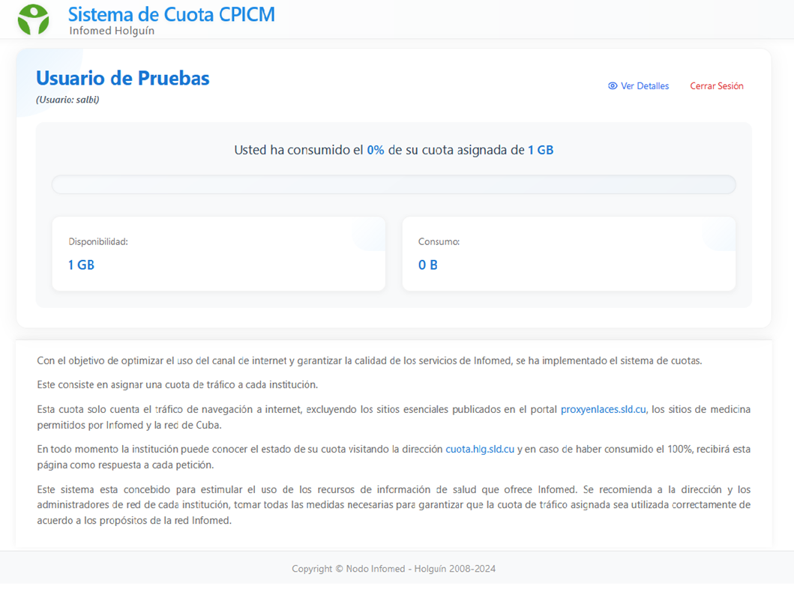
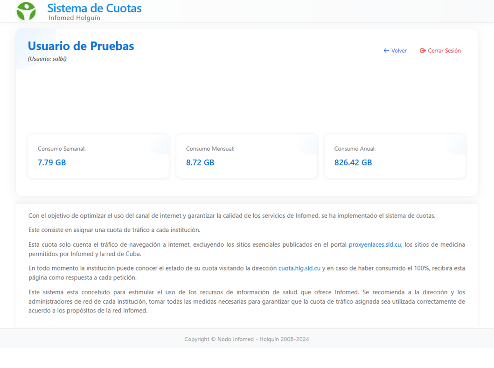
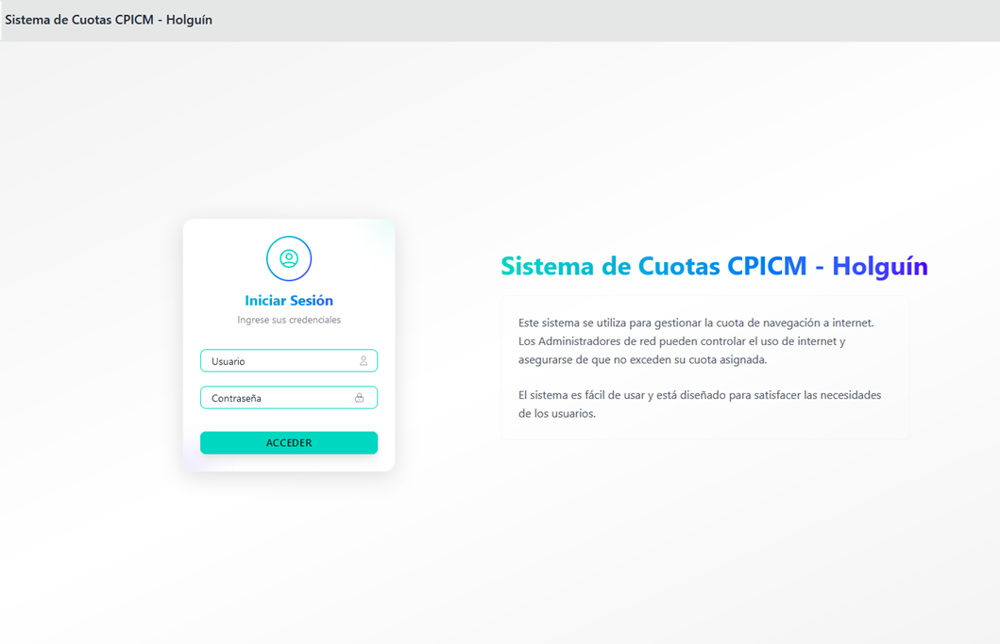
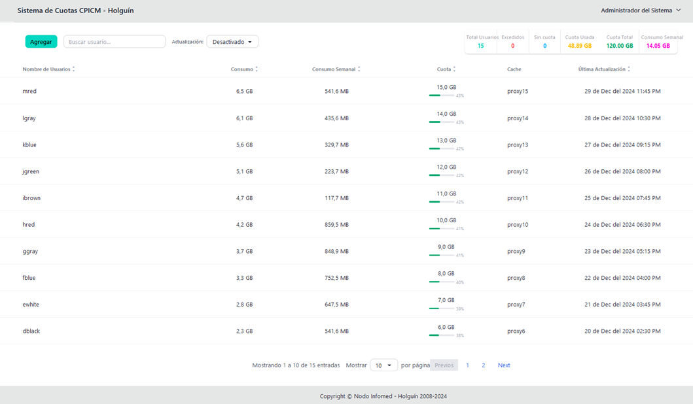
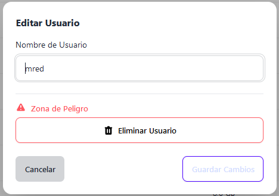
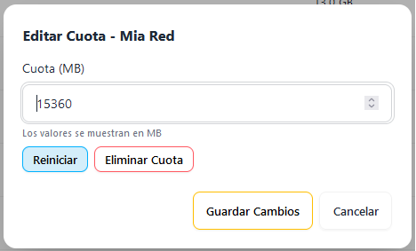

# 🦑 Sistema de Cuotas de Navegación Web para Squid Proxy

## Contenido
1. [Introducción](#introducción)
2. [Características Principales](#características-principales)
3. [Componentes](#componentes)
4. [Ideal Para](#ideal-para)
5. [Estado del Proyecto](#estado-del-proyecto)
6. [Stack Tecnológico](#stack-tecnológico)
7. [Guía de Instalación](#guía-de-instalación)
   - [Instalación en el Servidor Squid](#instalación-en-el-servidor-squid)
   - [Instalación del Servidor Web](#instalación-del-servidor-web)
8. [Tareas de Mantenimiento](#tareas-de-mantenimiento)
9. [Notas Importantes](#notas-importantes)
10. [Contribución](#contribución)
11. [Licencia](#licencia)

## Introducción
Un sistema integral y sofisticado para la gestión y control de cuotas de navegación web, diseñado específicamente para Squid Proxy. Este sistema de cuotas está diseñado para el control del consumo de datos por usuario, con reseteo automático configurable. El sistema incluye un login para que los usuarios puedan autenticarse, ver su cuota y consumo, y acceder a detalles diarios, semanales y anuales.

## 🌟 Características Principales
- 🚀 Monitoreo en tiempo real del consumo de datos.
- 💻 Interfaz administrativa en Django.
- 👥 Portal de usuario en PHP para consulta de cuotas.
- 📊 Reportes detallados de consumo.
- ⏰ Reseteo automático de cuotas (diario/semanal/mensual/anual).
- 🔄 Integración directa con Squid Proxy.
- 📱 Interfaces web responsive.

## 🧩 Componentes
- Backend en Python para procesamiento de logs.
- Panel administrativo en Django.
- Portal de usuario en PHP.
- Base de datos MariaDB.
- Scripts de mantenimiento automático.

## 🎯 Ideal Para
- Instituciones educativas.
- Empresas.
- Proveedores de servicios de Internet.
- Administradores de redes.

## 📈 Estado del Proyecto
🟢 En desarrollo activo | ✅ Estable para producción

Un sistema modular para la gestión de cuotas de navegación web, desarrollado en Python, Django y PHP. Integra procesamiento de logs de Squid en tiempo real, almacenamiento en MariaDB, y múltiples interfaces web para administración y consulta de usuarios.

## 🛠️ Stack Tecnológico
- **Backend:** Python 3.x
- **Framework Admin:** Django
- **Portal Usuario:** PHP 8.0
- **Base de Datos:** MariaDB
- **Proxy:** Squid
- **Servidor Web:** Nginx
- **Process Manager:** Supervisor

# 📚 Guía de Instalación del Sistema de Cuotas

## Descripción General
Este sistema consta de dos componentes principales:
1. **Servidor Squid + MariaDB + Scripts Python**
2. **Servidor Web (Interfaz administrativa Django + Interfaz usuario PHP)**

## 1. Instalación en el Servidor Squid

### 1.1 Instalación de MariaDB
```bash
# Instalar MariaDB
apt-get install mariadb-server

# Modificar la configuración para escuchar en todas las IPs
sed -i 's/bind-address.*127.0.0.1/bind-address = 0.0.0.0/' /etc/mysql/mariadb.conf.d/50-server.cnf

# Reiniciar MariaDB
systemctl restart mariadb
```

### 1.2 Configuración de la Base de Datos
```sql
mysql -u root -p

-- Crear base de datos y usuarios
CREATE DATABASE pquot;
CREATE USER 'pquot'@'localhost' IDENTIFIED BY 'pquotwebdb';
GRANT ALL PRIVILEGES ON pquot.* TO 'pquot'@'localhost';

-- Crear usuario para el servidor web (ajusta la IP según tu configuración)
CREATE USER 'pquot'@'localhost' IDENTIFIED BY 'pquotwebdb';
GRANT ALL PRIVILEGES ON pquot.* TO 'pquot'@'localhost';

FLUSH PRIVILEGES;
use pquot;
source /srv/cuotas/pquot.sql;
exit;
```

### 1.3 Instalación de Scripts Python
```bash
# Crear directorios necesarios
mkdir -p /etc/pquot
mkdir -p /var/spool/pquot
mkdir -p /var/log/pquot

# Copiar scripts Python
cp check_quota.py pquot-reader.py pquot-reset.py pquot-reset-semanal.py \
   pquot-reset-anual.py pquot-reset-mensual.py pquot-updater.py \
   pquot-update-users.py /usr/local/bin/

# Dar permisos de ejecución
chmod +x /usr/local/bin/pquot-*
chmod +x /usr/local/bin/check_quota.py
```

### 1.4 Configuración de Squid
Los archivos de configuración de Squid están en el repositorio en la ruta `squid\`:

- **Archivo de configuración principal:** `squid.conf`

Asegúrate de copiar el archivo `squid.conf` a la ubicación `/etc/squid/squid.conf` y luego reiniciar Squid:

```bash
# Reiniciar Squid
systemctl restart squid
```

## 2. Instalación del Servidor Web

### 2.1 Instalación de Dependencias
```bash
# Instalar paquetes necesarios
apt install python3 python3-pip python3-dev python3-venv nginx supervisor php8.0 php8.0-fpm php8.0-mysql
```

### 2.2 Configuración de la Interfaz Administrativa (Django)
```bash
# Crear estructura de directorios
mkdir -p /srv/cuotas/pquotadmin
cd /srv/cuotas/pquotadmin

# Crear y activar entorno virtual
python3 -m venv env
source env/bin/activate

# Instalar dependencias
pip install -r requirements.txt
```

### 2.3 Configuración de Django
```python
# Editar /srv/cuotas/pquotadmin/settings.py
DATABASES = {
    'default': {
        'ENGINE': 'django.db.backends.mysql',
        'NAME': 'pquot',
        'USER': 'pquot',
        'PASSWORD': 'pquotwebdb',
        'HOST': 'localhost',
        'PORT': '3306',
    }
}
```

### 2.4 Configuración de Gunicorn
Gunicorn es un servidor WSGI para aplicaciones web en Python. Es ampliamente utilizado para desplegar aplicaciones Django en producción debido a su capacidad para manejar múltiples solicitudes simultáneamente, lo que mejora el rendimiento y la escalabilidad de la aplicación.

El script de inicio de Gunicorn se encuentra en el repositorio en la ruta `www/pquotadmin/gunicorn_start.sh`, puedes descargarlo haciendo clic [aquí](www/pquotadmin/gunicorn_start.sh). Asegúrate de copiarlo a la ubicación adecuada y darle permisos de ejecución:

```bash
# Dar permisos de ejecución
chmod +x /srv/cuotas/pquotadmin/gunicorn_start.sh
```

### 2.5 Configuración de Supervisor
Supervisor es una herramienta de gestión de procesos que permite iniciar, detener y reiniciar aplicaciones automáticamente. Es especialmente útil para asegurar que las aplicaciones se mantengan en ejecución, reiniciándolas automáticamente en caso de fallos.

El archivo de configuración para Supervisor se encuentra en el repositorio en la ruta `www\pquotadmin\pquot_admin.conf`. puedes descargarlo haciendo clic [aquí](www\pquotadmin\pquot_admin.conf). Asegúrate de copiarlo a la ubicación adecuada

```bash
# Crear directorio para logs
mkdir -p /var/log/pquotadmin

# Reiniciar Supervisor
supervisorctl reread
supervisorctl update
supervisorctl start pquot_admin
```

### 2.6 Configuración de la Interfaz de Usuario (PHP)
```bash
# Crear directorio para la interfaz de usuario
mkdir -p /srv/cuotas/pquotuser
# Copiar archivos PHP de la interfaz de usuario
cp -r /ruta/origen/archivos_php/* /srv/cuotas/pquotuser/

# Configurar permisos
chown -R www-data:www-data /srv/cuotas/pquotuser
chmod -R 755 /srv/cuotas/pquotuser
```

### Guía para `config.php`
Este archivo de configuración está diseñado para establecer parámetros de conexión y opciones para un sistema que utiliza LDAP o Active Directory (AD) para la autenticación, así como para configurar la conexión a una base de datos.

#### 1. **Tipo de Servidor**
- **`USE_AD`**: Define si se utiliza Active Directory (AD) o LDAP. 
  - `true`: Utiliza AD.
  - `false`: Utiliza LDAP.

#### 2. **Configuración del Servidor LDAP/AD**
- **`LDAP_SERVER`**: Dirección IP o nombre del servidor LDAP/AD.
- **`LDAP_PORT`**: Puerto para la conexión LDAP. El valor por defecto es `389`.

#### 3. **Base DN para LDAP**
- **`LDAP_BASE_DN`**: Define la base DN (Distinguished Name) para las búsquedas LDAP. Asegúrate de que esta ruta sea correcta para tu organización.

#### 4. **Credenciales de Administrador**
- **`LDAP_ADMIN_DN`**: DN del administrador que tiene permisos para realizar búsquedas en el directorio.
- **`LDAP_ADMIN_PASSWORD`**: Contraseña del administrador LDAP.
- **`LDAP_BIND_REQUIRED`**: Indica si es necesario realizar un bind con las credenciales del administrador.

#### 5. **Opciones de LDAP**
- **`LDAP_PROTOCOL_VERSION`**: Versión del protocolo LDAP a utilizar. La versión `3` es la más común.
- **`LDAP_REFERRALS`**: Controla el manejo de referencias LDAP. `0` generalmente significa que las referencias están desactivadas.

#### 6. **Configuración de la Base de Datos**
- **`DB_HOST`**: Dirección IP o nombre del host de la base de datos.
- **`DB_USER`**: Usuario para la conexión a la base de datos.
- **`DB_PASS`**: Contraseña para el usuario de la base de datos.
- **`DB_NAME`**: Nombre de la base de datos a la que se conectará.
- **`DB_PORT`**: Puerto para la conexión a la base de datos, generalmente `3306` para MySQL.

#### 7. **Actualización Automática**
- **`AUTO_UPDATE_ENABLED`**: Activa o desactiva la actualización automática.
  - `true`: Activada.
  - `false`: Desactivada.
- **`AUTO_UPDATE_SECONDS`**: Intervalo de tiempo en segundos para la actualización automática.

#### 8. **Modo de Depuración**
- **`DEBUG_MODE`**: Controla si se muestran mensajes de depuración.
  - `true`: Muestra mensajes de depuración.
  - `false`: Oculta mensajes de depuración.

### 2.7 Configuración de Nginx
Los archivos de configuración de Nginx están en el repositorio en la ruta `ServerWebs\nginx\`, puedes descargarlo haciendo clic [aquí](ServerWebs\nginx\):

- **VirtualHost para la interfaz administrativa:** [`admincuotas.hlg.sld.cu.conf`](ServerWebs/nginx/admincuotas.hlg.sld.cu.conf)
- **VirtualHost para la interfaz de usuario:** [`cuotas.hlg.sld.cu.conf`](ServerWebs/nginx/cuotas.hlg.sld.cu.conf)

### Configuración de Apache (opcional)
Si prefieres usar Apache en lugar de Nginx, los archivos de VirtualHost están en el repositorio en la ruta `ServerWebs\apache2\`, puedes descargarlo haciendo clic [aquí](ServerWebs\apache2\):

- **VirtualHost para la interfaz administrativa:** [`admincuotas.hlg.sld.cu.conf`](ServerWebs/apache2/admincuotas.hlg.sld.cu.conf)
- **VirtualHost para la interfaz de usuario:** [`cuotas.hlg.sld.cu.conf`](ServerWebs/apache2/cuotas.hlg.sld.cu.conf)

## 3. Tareas de Mantenimiento

### 3.1 Configuración de Tareas Programadas
```bash
# Añadir al crontab
crontab

# Agregar las siguientes líneas:

## Sistema de cuotas de Infomed cada 10 segundos
*/1 * * * * root python /usr/local/bin/pquot-updater.py
*/1 * * * * root sleep 10 && python /usr/local/bin/pquot-updater.py
*/1 * * * * root sleep 20 && python /usr/local/bin/pquot-updater.py
*/1 * * * * root sleep 30 && python /usr/local/bin/pquot-updater.py
*/1 * * * * root sleep 40 && python /usr/local/bin/pquot-updater.py
*/1 * * * * root sleep 50 && python /usr/local/bin/pquot-updater.py

*/1 * * * * root python /usr/local/bin/pquot-update-users.py
*/1 * * * * root sleep 10 && python /usr/local/bin/pquot-update-users.py
*/1 * * * * root sleep 20 && python /usr/local/bin/pquot-update-users.py
*/1 * * * * root sleep 30 && python /usr/local/bin/pquot-update-users.py
*/1 * * * * root sleep 40 && python /usr/local/bin/pquot-update-users.py
*/1 * * * * root sleep 50 && python /usr/local/bin/pquot-update-users.py

###Resetear cuota cada 1 hora###
0 */1 * * * root python /usr/local/bin/pquot-reset.py && /etc/init.d/squid reload > /dev/null 2>&1

# Para reset mensual (ejecutar el primer día de cada mes a las 00:01)
1 0 1 * *   root python /usr/local/bin/pquot-reset-mensual.py

# Para reset anual (ejecutar el primer día del año a las 00:01)
1 0 1 1 *   root python /usr/local/bin/pquot-reset-anual.py

# Para reset semanal (ejecutar cada lunes a las 00:01)
1 0 * * 1   root python /usr/local/bin/pquot-reset-semanal.py
```

### 3.2 Verificación del Sistema
```bash
# Verificar estado de los servicios
systemctl status mariadb
systemctl status nginx
systemctl status php8.0-fpm
supervisorctl status pquot_admin

# Verificar logs
tail -f /var/log/nginx/AdminCuotas.error.log
tail -f /var/log/pquotadmin/gunicorn.err.log
tail -f /var/log/squid/access_cuotas.log
```

## 4. 📌 Notas Importantes
1. Ajustar las IPs y nombres de dominio según tu entorno.
2. Asegurar que los puertos necesarios están abiertos en el firewall.
3. Configurar copias de seguridad de la base de datos.
4. Revisar periódicamente los logs del sistema.
5. Mantener actualizados los componentes del sistema.

## 5. 📸 Capturas de Pantalla

### Página para que el usuario pueda ver su cuota y consumo

<table style="border-collapse: collapse; width: 100%; text-align: center;">
  <tr>
    <td style="border: none; padding: 10px;">
      
      <p style="font-style: italic; color: #555;">Pantalla de inicio de sesión</p>
    </td>
    <td style="border: none; padding: 10px;">
      
      <p style="font-style: italic; color: #555;">Pantalla de usuario</p>
    </td>
    <td style="border: none; padding: 10px;">
      
      <p style="font-style: italic; color: #555;">Detalles de cuotas</p>
    </td>
  </tr>
</table>


### Pagina de administración de usuarios
  
<table style="border-collapse: collapse; width: 100%; text-align: center;">
  <tr>
    <td style="border: none; padding: 10px;">
      
      <p style="font-style: italic; color: #555;">Pantalla de inicio de sesión</p>
    </td>
    <td style="border: none; padding: 10px;">
      
      <p style="font-style: italic; color: #555;">Detalles de usuarios</p>
    </td>
    <td style="border: none; padding: 10px;">
      
      <p style="font-style: italic; color: #555;">Editar usuario o Eliminar usuario</p>
    </td>
    <td style="border: none; padding: 10px;">
      
      <p style="font-style: italic; color: #555;">Resetear cuota o Eliminar cuota</p>
    </td>    
  </tr>
</table>
